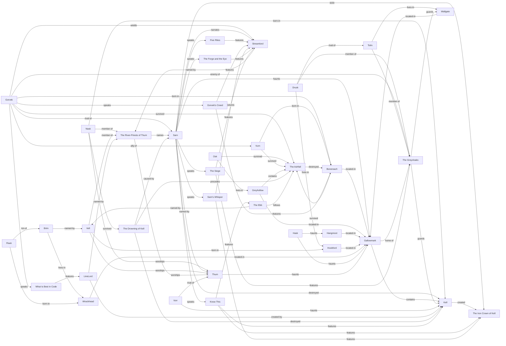

# Gallowmark, drawn

Generated by `node tools/lore.mjs build`. Declared relations only; inverses are implied. Quotes are not drawn.

```mermaid
graph LR
  brim["Brim"]
  drusk["Drusk"]
  gorvek["Gorvek"]
  nask["Nask"]
  osk["Osk"]
  rauk["Rauk"]
  sarn["Sarn"]
  tolm["Tolm"]
  vell["Vell"]
  vurn["Vurn"]
  bonereach["Bonereach"]
  gallowmark["Gallowmark"]
  greyhollow["Greyhollow"]
  hangmoot["Hangmoot"]
  hookford["Hookford"]
  kell["Kell"]
  wallgate["Wallgate"]
  wrackhead["Wrackhead"]
  greycloaks["The Greycloaks"]
  river-priests["The River-Priests of Thurn"]
  hask["Hask"]
  thurn["Thurn"]
  vorr["Vorr"]
  iron-crown-of-kell["The Iron Crown of Kell"]
  linelord["LineLord"]
  streamlord["Streamlord"]
  the-ashfall["The Ashfall"]
  the-drowning-of-kell["The Drowning of Kell"]
  the-ebb["The Ebb"]
  five-rites["Five Rites"]
  gorveks-creed["Gorvek's Creed"]
  know-this["Know This"]
  sarns-whisper["Sarn's Whisper"]
  the-forge-and-the-eye["The Forge and the Eye"]
  the-siege["The Siege"]
  what-is-best-in-code["What Is Best in Code"]
  brim -- lives-in --> wrackhead
  brim -- named-by --> vell
  drusk -- member-of --> greycloaks
  drusk -- lives-in --> hookford
  drusk -- rival-of --> tolm
  gorvek -- born-in --> bonereach
  gorvek -- survived --> the-ashfall
  gorvek -- wields --> streamlord
  gorvek -- enemy-of --> greycloaks
  gorvek -- rival-of --> sarn
  gorvek -- ally-of --> vurn
  nask -- member-of --> river-priests
  nask -- worships --> thurn
  nask -- born-in --> kell
  nask -- survived --> the-drowning-of-kell
  osk -- lives-in --> greyhollow
  osk -- survived --> the-ashfall
  rauk -- born-in --> wrackhead
  rauk -- kin-of --> brim
  sarn -- stole --> iron-crown-of-kell
  sarn -- named-by --> thurn
  sarn -- haunts --> gallowmark
  sarn -- narrates --> streamlord
  sarn -- destroyed --> kell
  tolm -- member-of --> greycloaks
  tolm -- lives-in --> wallgate
  vell -- member-of --> river-priests
  vell -- worships --> thurn
  vell -- born-in --> hookford
  vurn -- born-in --> bonereach
  vurn -- survived --> the-ashfall
  bonereach -- located-in --> gallowmark
  bonereach -- survived --> the-ashfall
  gallowmark -- contains --> kell
  gallowmark -- home-of --> greycloaks
  greyhollow -- located-in --> gallowmark
  greyhollow -- contains --> the-ashfall
  hangmoot -- located-in --> gallowmark
  hookford -- located-in --> gallowmark
  kell -- created --> iron-crown-of-kell
  wallgate -- located-in --> gallowmark
  wrackhead -- located-in --> gallowmark
  greycloaks -- guards --> kell
  greycloaks -- guards --> wallgate
  river-priests -- worships --> thurn
  river-priests -- names --> sarn
  hask -- haunts --> gallowmark
  hask -- haunts --> hangmoot
  thurn -- haunts --> gallowmark
  vorr -- haunts --> kell
  vorr -- rival-of --> thurn
  linelord -- named-by --> river-priests
  linelord -- created-by --> kell
  streamlord -- named-by --> river-priests
  the-ashfall -- destroyed --> bonereach
  the-drowning-of-kell -- destroyed --> kell
  the-drowning-of-kell -- caused-by --> sarn
  the-drowning-of-kell -- precedes --> the-ashfall
  the-ebb -- follows --> the-ashfall
  the-ebb -- named-by --> vell
  five-rites -- features --> streamlord
  sarn -- speaks --> five-rites
  gorveks-creed -- features --> streamlord
  gorveks-creed -- features --> bonereach
  gorvek -- speaks --> gorveks-creed
  know-this -- features --> the-ebb
  know-this -- features --> kell
  know-this -- features --> iron-crown-of-kell
  sarn -- speaks --> know-this
  sarns-whisper -- features --> streamlord
  sarns-whisper -- features --> iron-crown-of-kell
  sarn -- speaks --> sarns-whisper
  the-forge-and-the-eye -- features --> streamlord
  sarn -- speaks --> the-forge-and-the-eye
  the-siege -- features --> streamlord
  the-siege -- features --> greycloaks
  sarn -- speaks --> the-siege
  what-is-best-in-code -- features --> linelord
  gorvek -- speaks --> what-is-best-in-code
```
